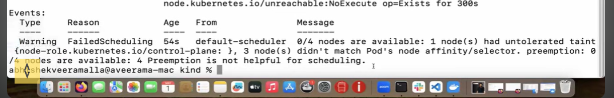

# Kubernetes Node Selector Troubleshooting

## What is Node Selector?

Node Selector is a simple way in Kubernetes to control **which node a pod should run on**.

It works using **labels on nodes**.

Example:

Node label:

```
disk=ssd
```

Pod configuration:

```yaml
spec:
  nodeSelector:
    disk: ssd
```

This means the pod will only run on nodes that have the label `disk=ssd`.

---

## Why Do We Use Node Selector?

say we have ARM vs AMD architecture and our node only suitable with arm, then we use node selector to select this pod only run on this node not the other

---

## Common Problem


Pods stay in **Pending** state.


This means Kubernetes cannot find a node with the required label.

---

## Troubleshooting Steps

### Step 1: Check Pod Status

```
kubectl get pods
```

If the pod is pending, describe it.

```
kubectl describe pod <pod-name>
```

Look for scheduling errors.

---

### Step 2: Check Node Labels

```
kubectl get nodes --show-labels
```

Verify if the label required by the nodeSelector exists.

---

### Step 3: Add Label to Node

If the label does not exist, add it.

```
kubectl label nodes node-1 disk=ssd
```

---

### Step 4: Verify Scheduling

Nodes have labels, and pods use nodeSelector to select nodes with matching labels.

Once labels match, Kubernetes scheduler can place the pod on the correct node.


---


# Kubernetes Node Labels and NodeSelector

## 1. Node Labels

Labels are **key-value pairs added to nodes** to describe their characteristics.

Examples:

* environment = production
* disk = ssd
* gpu = true

Example Node YAML (labels under metadata):

```yaml
apiVersion: v1
kind: Node
metadata:
  name: worker-node-1
  labels:
    environment: production
    disk: ssd
```

This means the node now has:

```
environment=production
disk=ssd
```

---

## 2. Pod Using NodeSelector

Pods use **nodeSelector** to run only on nodes that match specific labels.

Example Pod YAML:

```yaml
apiVersion: v1
kind: Pod
metadata:
  name: nginx
spec:
  containers:
  - name: nginx
    image: nginx
  nodeSelector:
    environment: production
```

Meaning:

```
Run this pod only on nodes where environment=production
```

---

## 3. How Scheduling Works

```
Node
 └─ label → environment=production

Pod
 └─ nodeSelector → environment=production
```

If the label matches, Kubernetes scheduler places the pod on that node.

---

## 4. Real Example Flow

```
Node Labels:
node-1 → environment=production
node-2 → environment=dev

Pod configuration:
nodeSelector:
  environment: production
```

Result:

```
Pod runs only on node-1
```

---

## 5. Interview Explanation

> Nodes are labeled using key-value pairs under metadata.labels, and pods use nodeSelector to schedule workloads onto nodes that match those labels.


---

## Interview Explanation

> NodeSelector is used to constrain pods to run on specific nodes based on labels. If no node matches the selector, the pod remains in Pending state. Troubleshooting involves checking node labels and ensuring they match the nodeSelector requirements.
